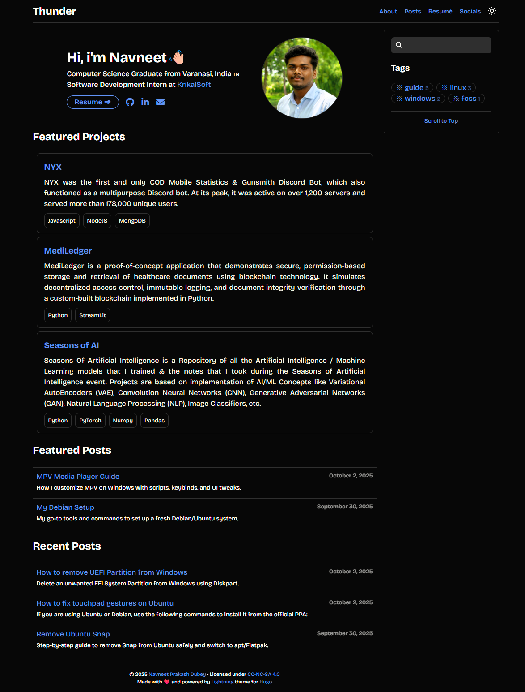

    <h1><a href="https://thundere75.github.io/" target="_blank">Thunder (Personal/Portfolio Website)</a></h1>
    
Content licensed under <a href="https://creativecommons.org/licenses/by-nc-sa/4.0/" target="_blank">CC-NC-SA 4.0</a> Tech licensed under <a href="./LICENSE" target="_blank">GNU GPLv3</a>

    <picture>
        <source media="(prefers-color-scheme: dark)" srcset="./images/homepage_dark.png" />
        <source media="(prefers-color-scheme: light)" srcset="./images/homepage_light.png" />
        
    </picture>

